# LAB 2 Report

## Designing

We implemented a naive RAFT consensus cluster in this lab. The leader of the cluster serves as the trader. All the members in the cluster maintain the same ledger but in a distributed database held by each one(different database in one CouchDB server). RAFT mechanism guarantees partition consistency and fault tolerance. We implemented all necessary functions including leader election, log synchronization, and service available checking. 

Some of the crucial design is shown in the graph below.

### 1. Leader Election

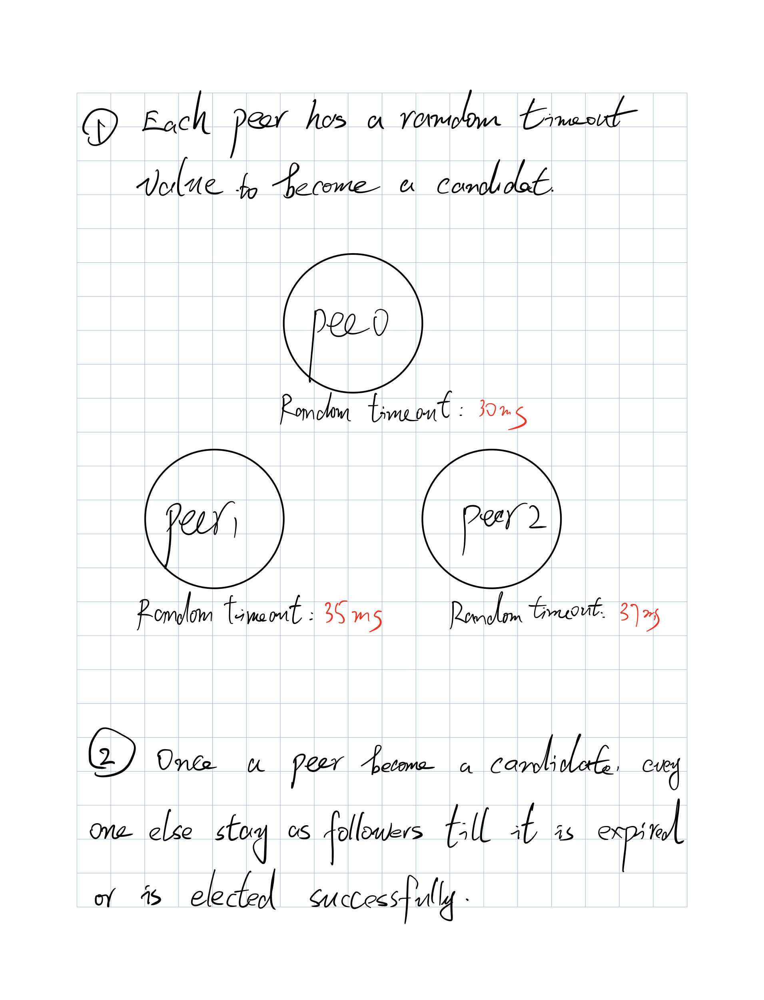

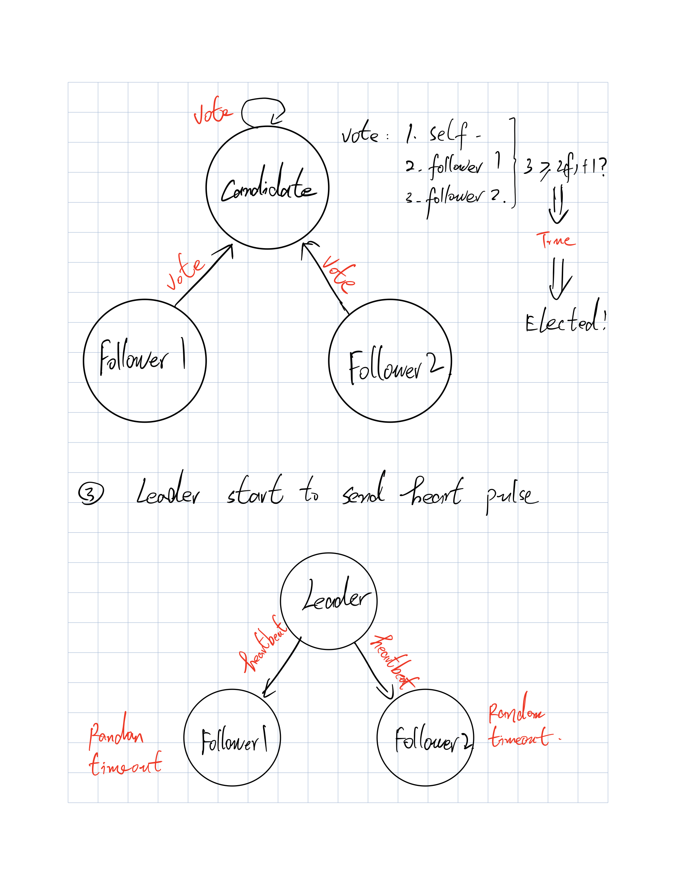

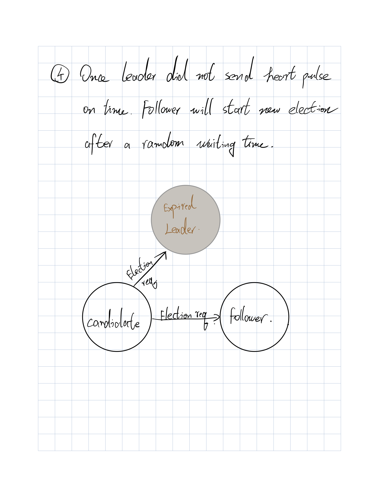

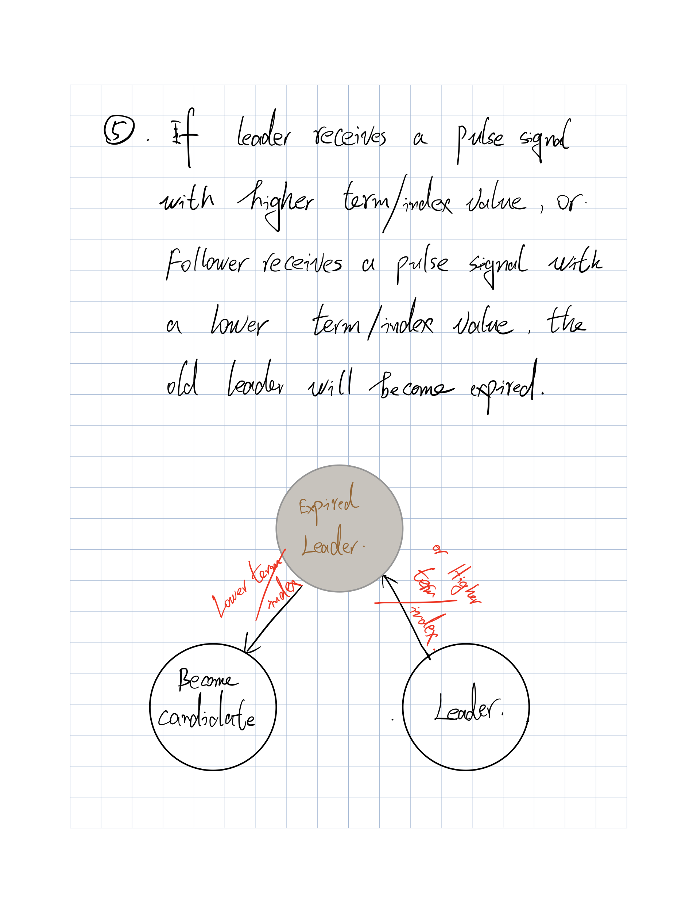

### 2. Log Alignment

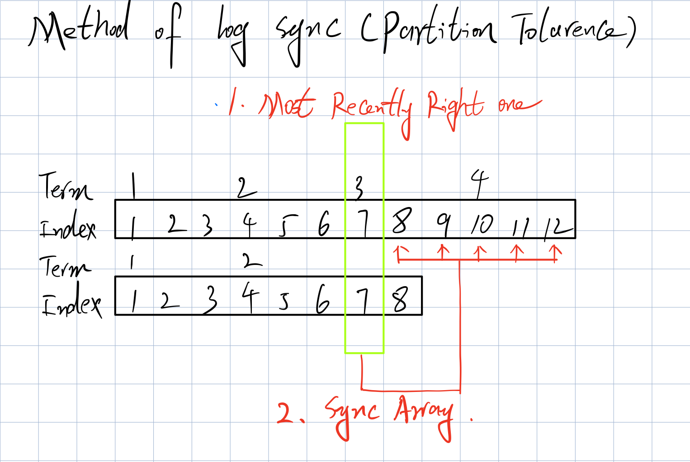

### 3. An Example of How to Apply a Transaction

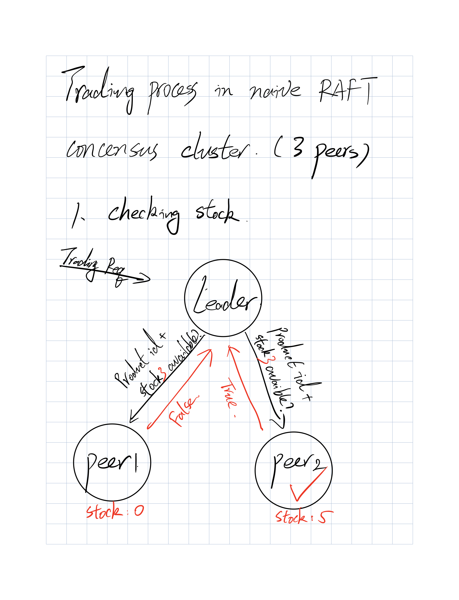

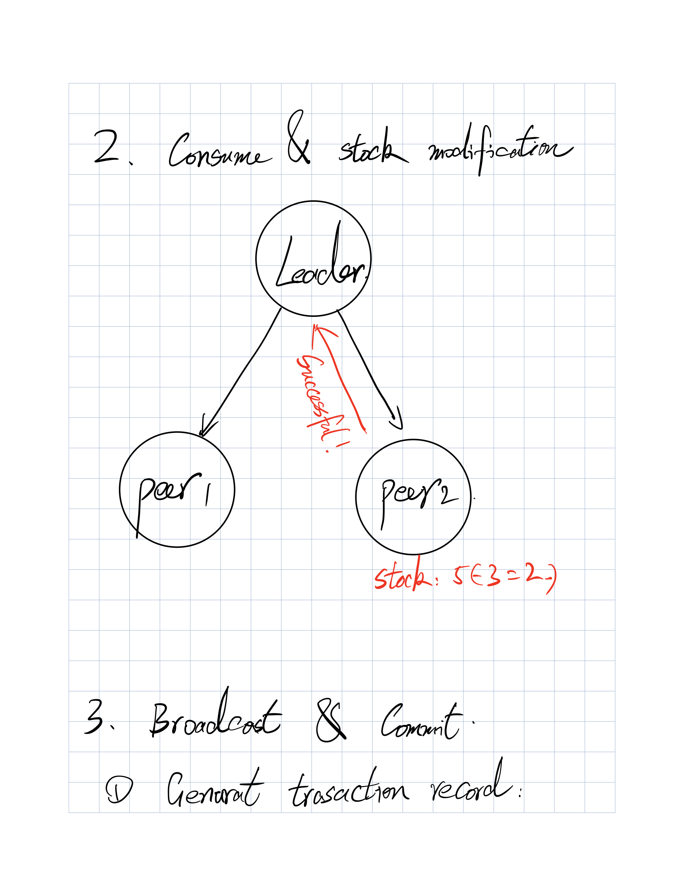

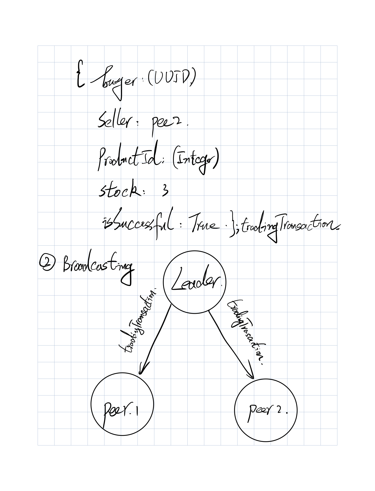

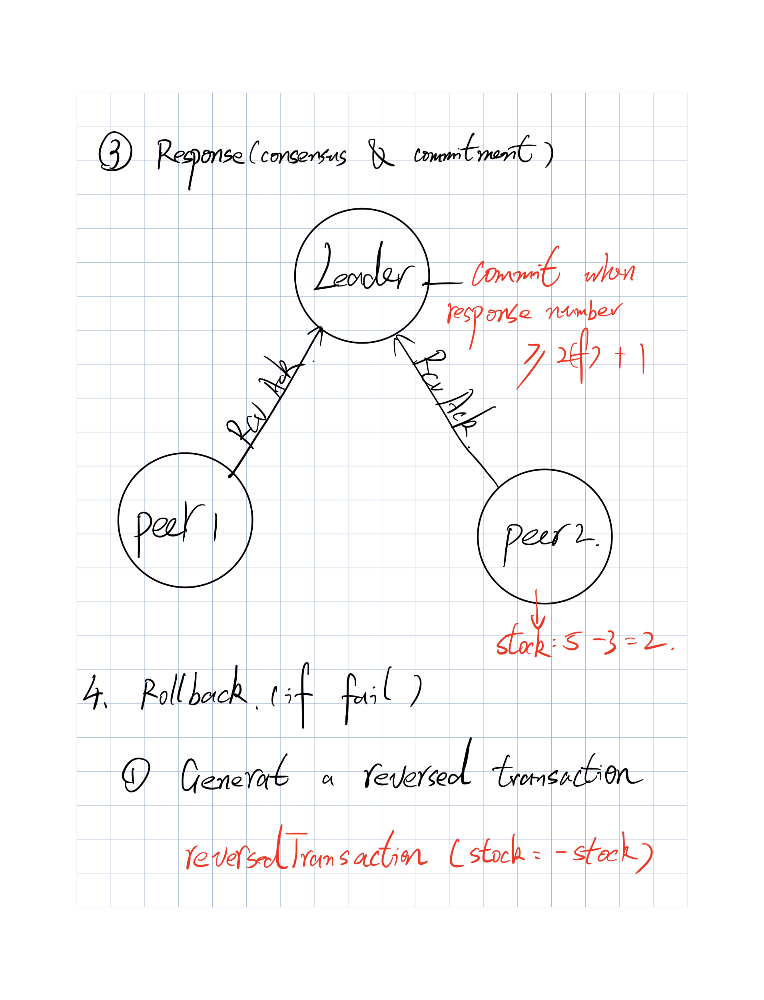

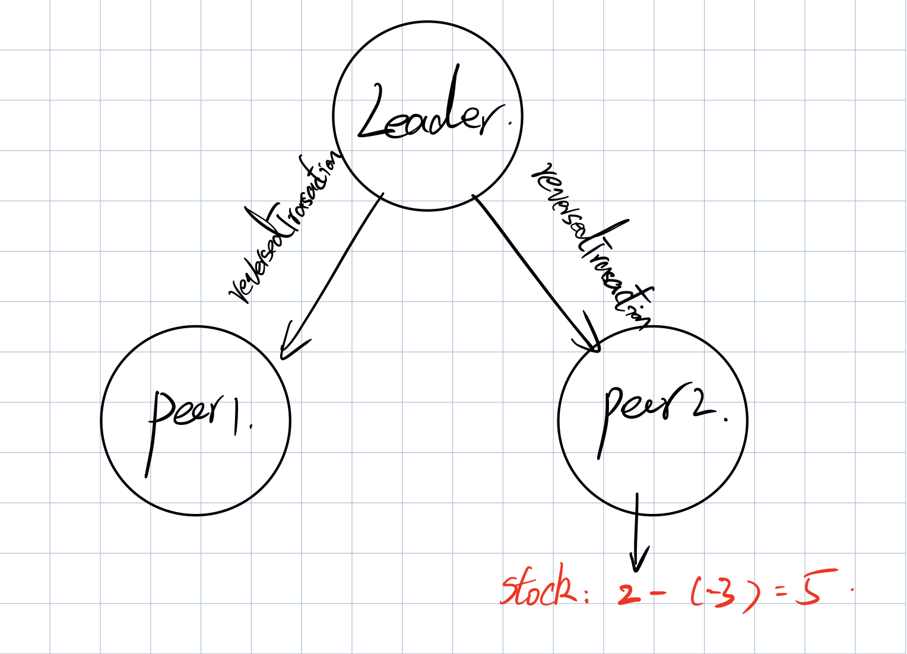


## Functional & Performance Testing

### A. Deploy All Locally in Container

We deployed six peers (three sellers and three buyers, one CouchDB data server) in docker containers and launched 972 transactions (324 from each buyer). 

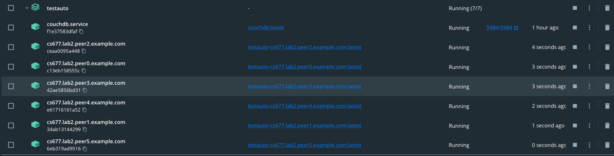

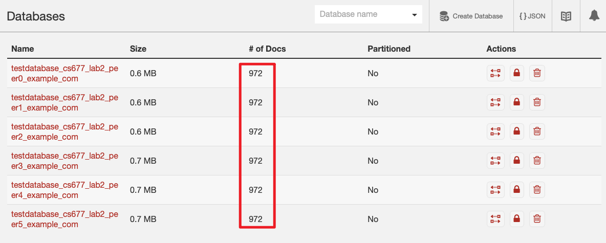


**The results are shown below.**

```shell
# The average transaction time is 147 ms.

2022-12-14 06:18:27 2022.12.14 11:18:27 UTC Thread-2 INFO  com.zhexu.cs677_lab2.business.logEventHandler.Impl.MarketTransactionHandlerImpl 63 run - 
2022-12-14 06:18:27 ****************************************************************************************
2022-12-14 06:18:27 
2022-12-14 06:18:27 Transaction: b9926dc5-dec8-41c2-b816-809fb2570649 takes 141 ms
2022-12-14 06:18:27 Average transaction time=147 ms
2022-12-14 06:18:27 Transaction details:MarketTransaction{transactionId=b9926dc5-dec8-41c2-b816-809fb2570649, buyer=811f7b7c-36dc-449e-9f75-bae063cf49ce, seller=8128ec3b-0ef0-42bc-b967-1a4697a6cbd1, product=1:Salt, number=7, successful=true, remark='Salt', stock=83, eventId=083cb817-18d2-43a5-b7b7-4b3860985645}
2022-12-14 06:18:27 ****************************************************************************************

# Transaction during the leader change(re-election process) would be much longer than normal ones.

2022-12-14 06:18:55 2022.12.14 11:18:55 UTC Thread-3044 INFO  com.zhexu.cs677_lab2.business.logEventHandler.Impl.MarketTransactionHandlerImpl 63 run - 
2022-12-14 06:18:55 ****************************************************************************************
2022-12-14 06:18:55 
2022-12-14 06:18:55 Transaction: a14064cf-27a9-4973-adb5-a47e85eb91bd takes 2140 ms
2022-12-14 06:18:55 Average transaction time=362 ms
2022-12-14 06:18:55 Transaction details:MarketTransaction{transactionId=a14064cf-27a9-4973-adb5-a47e85eb91bd, buyer=811f7b7c-36dc-449e-9f75-bae063cf49ce, seller=8128ec3b-0ef0-42bc-b967-1a4697a6cbd1, product=2:Boar, number=37, successful=true, remark='Boar', stock=60, eventId=1101d993-6c88-411c-8b70-0d9583a9f832}
2022-12-14 06:18:55 ****************************************************************************************


```


### B. Deploy Leader On Remote Ubuntu Server & Others Locally.

**Leader on remote Ubuntu:**

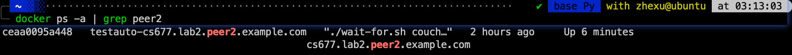


**Peers locally (including CouchDB server):**


**Results:**

For the first several times of tests, the remote leader always times out and was driven by followers. Then we increased the value of “pulseTimeOut”,  it could run well. But the average time was higher than before(about 2 to 4 times the network latency ) 

**Network latency to remote server:**

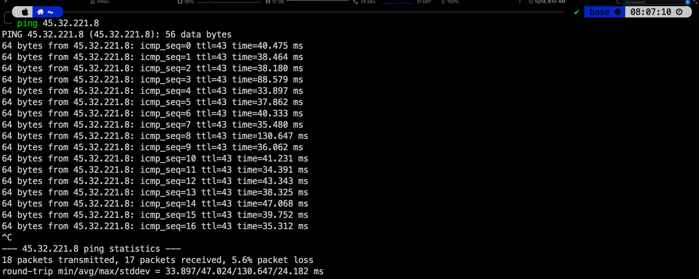

Average network latency: 46.58 ms

**Transaction Result:**

```shell
2022-12-14 08:18:37 2022.12.14 13:18:37 UTC Thread-2 INFO  com.zhexu.cs677_lab2.business.logEventHandler.Impl.MarketTransactionHandlerImpl 63 run - 
2022-12-14 08:18:37 ****************************************************************************************
2022-12-14 08:18:37 
2022-12-14 08:18:37 Transaction: d9b4919f-ea24-425e-aab9-9e227c903cf9 takes 58 ms
2022-12-14 08:18:37 Avarege transaction time=377 ms
2022-12-14 08:18:37 Transaction details:MarketTransaction{transactionId=d9b4919f-ea24-425e-aab9-9e227c903cf9, buyer=1b5178d9-ff23-4506-ba87-fb146d5f1273, seller=811f7b7c-36dc-449e-9f75-bae063cf49ce, product=0:Fish, number=14, successful=true, remark='Fish', stock=88, eventId=bc161c34-6a88-4958-9c3f-1c08a9366329}
2022-12-14 08:18:37 ****************************************************************************************
```

$$
Average time: 377_{remotely} \div 147_{locally} \approx\ 2.5
$$

## How to Run

1. Adjust the config file (config.yml).

   ```yaml
   # configs of the market
   peerNumber: 6
   sellerNumber: 3
   buyerNumber: 3
   port: 2121
   deployOnSingleComputer: false
   sleepBeforeStart: 10000
   numberOfTests: 324
   
   
   maxmumStok: 100
   productNameList:
     - Fish
     - Salt
     - Boar
   
   
   
   # config of runner
   rpcBuffSize: 10240
   
   # not use any more
   neighbourNum: 1
   maxJump: 5
   ```

   

2. cd to the test dir.

   ```shell
   cd ${APPROOT}/src/testAuto
   ```

3. Run start script.

   ```shell
   sh runDocker.sh
   ```

4. Stop & Clean.

   ```shell
   docker-compose down & sh clear.sh
   ```

   
